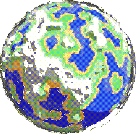

# <i> Olá Mundo! </i> 
Meu nome é **Diego Rockenbach**, tenho 18 anos e me apaixonei pela programação durante meu ensino médio. Desde então venho programando, seja por trabalho, estudo, lazer ou projetos próprios.

Pronomes: ele/dele.   

- Formado no Ensino Médio Integrado com Técnico de Informática - IFFar, Santo Augusto;
- Experiência profissional como Desenvolvedor Full-stack;
- Atualmente graduando em Sistemas de Informação - UFSM, Santa Maria;   

> Estudando muito e tentando achar minha melhor versão no mundo da programação. Você já achou a sua?
 

---

# <i> Hello World! </i> 

My name is **Diego Rockenbach**, I am 18 years old and I fell in love with programming during Middle School. Since then I have been programming, whether for work, study, leisure or personal projects.

Pronouns: he/him.   

- Graduated from High School Integrated with Computer Technician - IFFar, Santo Augusto;
- Professional experience as a Full-stack Developer;
- Currently graduating in Information Systems - UFSM, Santa Maria;   

> Studying hard and trying to find my best version in the programming world. Have you found yours yet?
 

---

## <b> ➥ Experience with... </b>

 
  
  <a href="https://en.wikipedia.org/wiki/C_(programming_language)" target="_blank">
  <a href="https://developer.mozilla.org/docs/Web/HTML" target="_blank">
  <a href="https://developer.mozilla.org/docs/Web/CSS" target="_blank">
  <a href="https://getbootstrap.com/" target="_blank">
  <a href="https://www.python.org/" target="_blank">
  <a href="https://redis.com/" target="_blank">
  <a href="https://www.java.com/" target="_blank">
  <a href="https://developer.mozilla.org/docs/Web/JavaScript" target="_blank">
  <a href="https://en.wikipedia.org/wiki/SQL" target="_blank">
  <a href="https://www.docker.com/" target="_blank">

